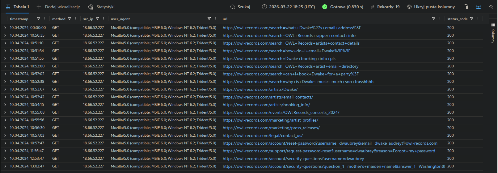
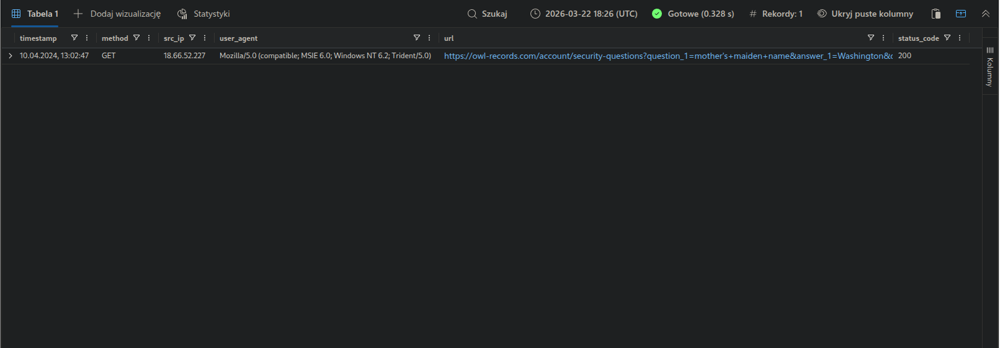
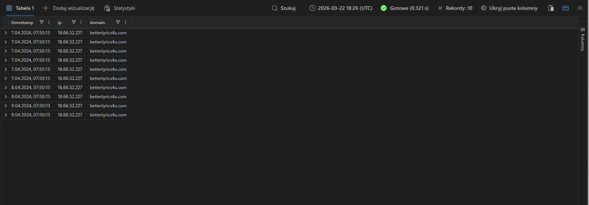
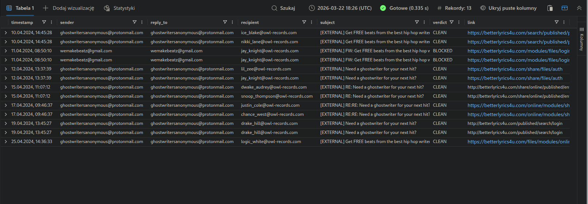
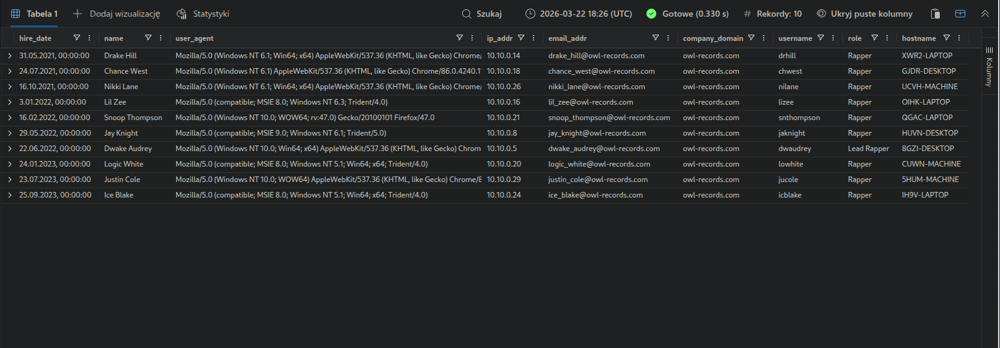
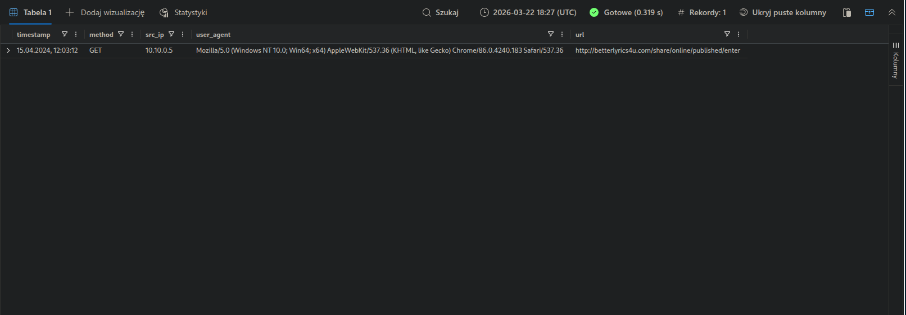
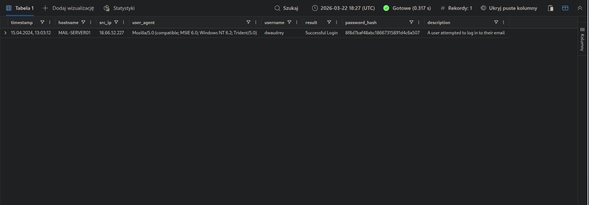

# KC7 Cyber Detective Game – Rap Beef

## Overview
This write-up documents my work on **Rap Beef**, an introductory investigation on the KC7 platform.

The scenario is built around a fictional feud between two hip-hop artists. What starts as a themed and slightly humorous case turns into a basic security investigation involving phishing, exposed sensitive information, and account compromise.

For me, this lab felt more like a guided walkthrough than a difficult challenge, but it was still a good way to explore how KC7 presents investigations and how KQL can be used in that workflow.

---

## Scenario Summary
In this scenario, I took the role of a security analyst at **OWL Records**. The investigation focused on suspicious activity connected to a rap feud, where oversharing in song lyrics and follow-up phishing activity eventually led to unauthorized access.

The lab revolved around:
- reviewing email activity for phishing indicators,
- identifying suspicious domains and IP addresses,
- connecting exposed personal information to account compromise.

---

## What the Lab Covered
This investigation introduced several basic blue team concepts, including:

- using **KQL** to query available data,
- analyzing emails for phishing-related activity,
- tracking infrastructure used by the threat actor,
- following the chain from information exposure to account takeover.

---

## Investigation Notes

### Email and Phishing Analysis
The email analysis mainly consisted of reviewing the contents of individual columns for suspicious activity, based on the indicators provided in the scenario.

One example query was:

```kql
let _targets = Email
| where link has "betterlyrics4u.com"
| distinct recipient;
```

In this case, `betterlyrics4u.com` was the domain used by the threat actor to send phishing emails. Based on the email contents and the analysis of searches performed from compromised accounts, I was able to determine what the threat actor was looking for, what sensitive information was accessed, and when it happened.

### Threat Infrastructure
The malicious domain used in the attack was `betterlyrics4u.com`. I was able to identify it based on the IP address from which the threat actor reset the password for one of the corporate accounts, using information that one of the rappers had unintentionally revealed in the lyrics of a diss track aimed at his rival.

Starting from that IP address, I identified the related domain. From the domain, I was then able to trace the phishing emails that had been sent to company email accounts. Unfortunately, the phishing attempt was successful, but it was still possible to determine when the compromise took place. I would like to think this would have led to remediation, although that part was not covered by the scenario.

### Key Finding
One of the more memorable parts of the scenario was that sensitive information was exposed in a rap verse, which later played a role in the compromise of the account.

---

## Queries Used

### 1. Investigating activity from the suspicious IP address
```kql
InboundNetworkEvents
| where timestamp between (datetime("2024-04-10T00:00:00") .. datetime("2024-04-11T00:00:00"))
| where src_ip has "18.66.52.227"
```

**Output:**  


### 2. Looking for searches related to the exposed information
```kql
InboundNetworkEvents
| where timestamp between (datetime("2024-04-10T00:00:00") .. datetime("2024-04-11T00:00:00"))
| where url has_any("washington", "fluffy")
| where src_ip has "18.66.52.227"
```

**Output:**  


### 3. Resolving the suspicious IP to a domain
```kql
PassiveDns
| where ip == "18.66.52.227"
```

**Output:**  


### 4. Finding phishing emails linked to the malicious domain
```kql
Email
| where link has "betterlyrics4u.com"
```

**Output:**  


### 5. Identifying users targeted by the phishing campaign
```kql
let _targets = Email
| where link has "betterlyrics4u.com"
| distinct recipient;

Employees
| where email_addr in (_targets)
```

**Output:**  


### 6. Confirming interaction with the phishing page
```kql
OutboundNetworkEvents
| where url == "http://betterlyrics4u.com/share/online/published/enter"
| where src_ip == "10.10.0.5"
```

**Output:**  


### 7. Verifying the account compromise
```kql
AuthenticationEvents
| where username == "dwaudrey"
| where src_ip == "18.66.52.227"
```

**Output:**  


### 8. Reviewing post-compromise activity
```kql
InboundNetworkEvents
| where timestamp between (datetime("2024-04-12T00:00:00") .. datetime("2024-05-01T00:00:00"))
| where url has "dwaudrey"
| where src_ip has "18.66.52.227"
```

**Output:**  


---

## Personal Take
KC7 has a very original style of teaching investigations. This lab was simple and heavily guided, so I treated it more as an introduction to the platform than a serious analytical challenge.

Even so, the scenario was creative, easy to follow, and enjoyable to complete. It was a useful first look at how incident analysis can be presented in a more interactive format.

---

## Skills Practiced
- KQL
- phishing analysis
- email investigation
- indicator correlation
- basic incident analysis

---

## Final Thoughts
Rap Beef was more of a guided introduction than a real challenge, but it was still a fun way to get familiar with how KC7 presents investigations. The scenario was simple, a bit unusual, and a decent starting point for practicing basic phishing analysis with KQL.
